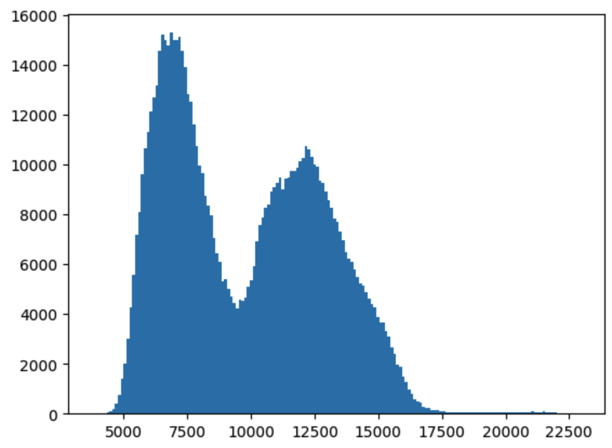
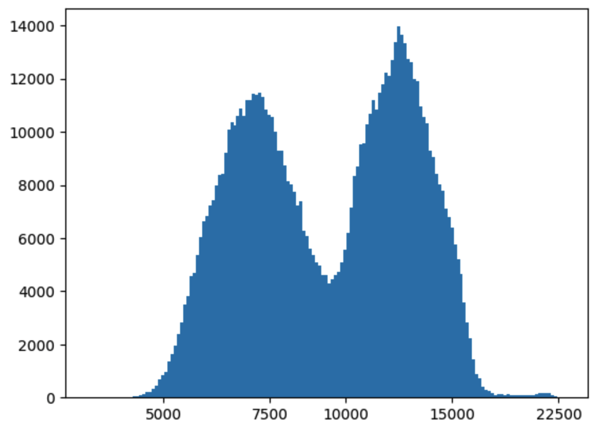
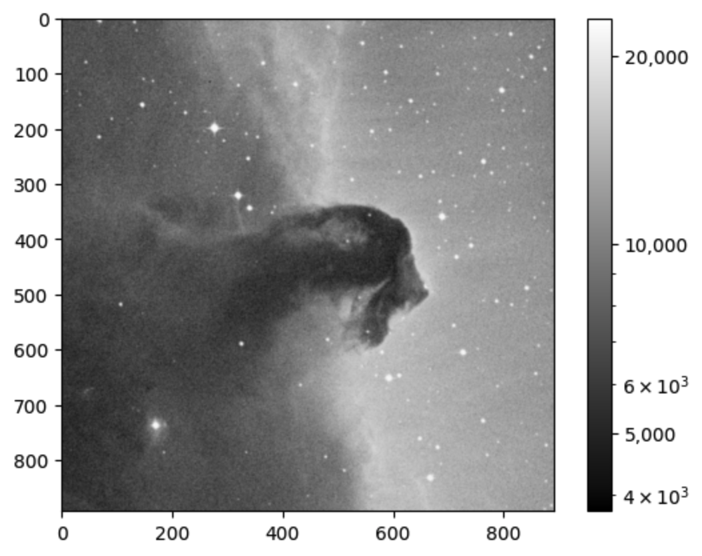

# Astropy

*"The astropy package contains key functionality and common tools needed for performing astronomy and astrophysics with Python. It is at the core of the Astropy Project, which aims to enable the community to develop a robust ecosystem of affiliated packages covering a broad range of needs for astronomical research, data processing, and data analysis."* -- https://docs.astropy.org/en/stable/index.html

### Working with FITS data
*FITS (Flexible Image Transport System) is the data format most widely used within astronomy for transporting, analyzing, and archiving scientific data files. FITS is much more than just another image format (such as JPG or GIF) and is primarily designed to store scientific data sets consisting of multidimensional arrays (images) and 2-dimensional tables organized into rows and columns of information.* -- https://fits.gsfc.nasa.gov/fits_primer.html


**Learning Goals:**
1. Open FITS files and load image data
2. Make a 2D histogram with image data
3. Stack several images into a single image
4. Write image data to a FITS file

Firstly, import the required modules:
```python
from astropy.io import fits
from astropy.utils.data import download_file
import matplotlib.pyplot as plt
from matplotlib.colors import LogNorm
import numpy as np
```

Let's grab an example FITS image from the web:
```python
image_file = download_file('http://data.astropy.org/tutorials/FITS-images/HorseHead.fits', cache=True )
hdu_list = fits.open(image_file)
```
and display the "header" information:
```python
hdu_list.info()

No.    Name      Ver    Type      Cards   Dimensions   Format
  0  PRIMARY       1 PrimaryHDU     161   (891, 893)   int16   
  1  er.mask       1 TableHDU        25   1600R x 4C   [F6.2, F6.2, F6.2, F6.2] 
```

Focussing on the actual image data:
```python
image_data = hdu_list[0].data
hdu_list.close()
```
We find:
```python
print(type(image_data))
print(image_data.shape)

<class 'numpy.ndarray'>
(893, 891)
```

Alternatively, we can define the image data more directly (if we're not concerned about viewing/modifying the header information):
```python
image_data = fits.getdata(image_file)
```
Looking at some numerical stats:
```python
print('Min:', np.min(image_data))
print('Max:', np.max(image_data))
print('Mean:', np.mean(image_data))
print('Stdev:', np.std(image_data))

Min: 3759
Max: 22918
Mean: 9831.481676287574
Stdev: 3032.3927542049046
```

Finally, let's visualise the image:
```python
plt.imshow(image_data, cmap='gray')
plt.colorbar()
```
<div>

</div>

Depending on the dynamic range involved, it might be better to visualise things on a different scale (in this case, one that might reduce the effective contrast). To gauge the situation, let's plot a histogram of all the pixels. To do this, we can use the flatten method to first transform the 2D values into a single 1D array:
```python
plt.hist(image_data.flatten(), bins=50)
```
<div>

</div>
From this it is evident that the distribution of pixels is skewed towards the dimmer end. We can enhance the original image if we consider a log scaling:

```python
fig, ax = plt.subplots()
ax.hist(np.log(image_data.flatten()), bins='auto')
xticks = np.array([5000, 7500, 10000, 15000, 22500])
ax.set_xticks(np.log(xticks))
ax.set_xticklabels(xticks)
```
<div>

</div>
which effectively balances out/normalises the pixel values. Finally, let's view the original image in this logarithmic scale:

```python
plt.imshow(image_data, cmap='gray', norm=LogNorm())
cbar = plt.colorbar(ticks=[5.e3,1.e4,2.e4])
cbar.ax.set_yticklabels(['5,000','10,000','20,000'])
```
<div>

</div>
