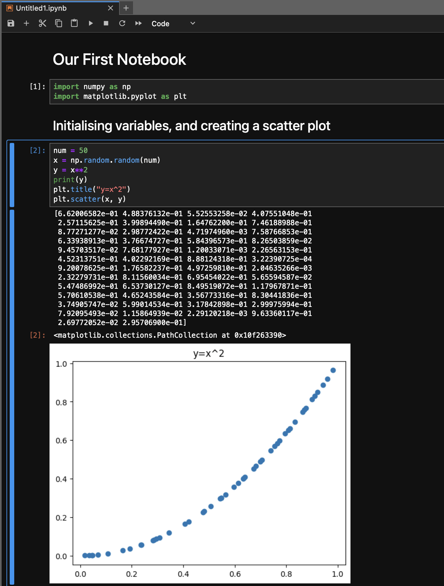
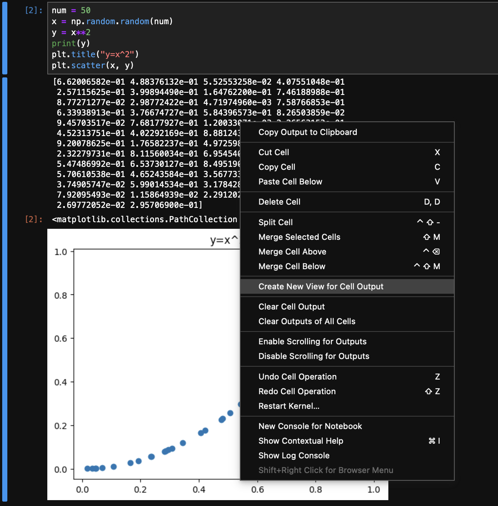
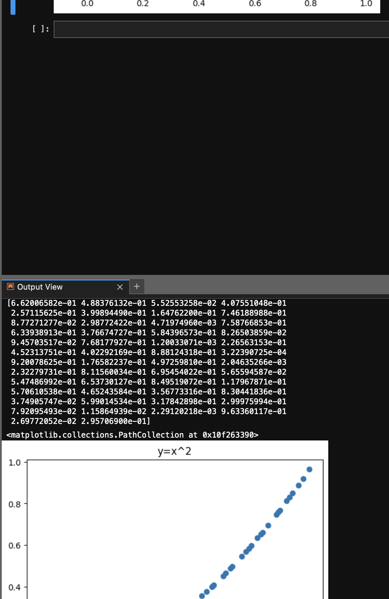

# JupyterLab

Up to now, your workflow relied on the Spyder IDE, in which you executed Python code interactively within the console (effectively "IPython"), or non-interactively via Python scripts. 

As an alternative, we will cover the basics of using the JupyterLab interface, highlighting the common use-cases for it, and also how it differs from the Spyder IDE.

JupyterLab can be started via the main menu of the Anaconda Navigator:
<div>

</div>

which will automatically open up a webpage in your local web browser, at usually the following URL: `http://localhost:8888/lab/tree`. 

### The Basics

#### Main menu (launcher screen)
<div>
    
</div>

Besides the File Browser on the left, you will be presented with a number of different components that you may start up:
1. Notebook
2. Console 
3. Terminal
4. Text File
5. Markdown File
6. Python File
7. Show Contextual Help

#### Some key reasons for using JupyterLab over Spyder
- Notebooks offer data scientists arguably a more convenient and interactive way of working on their datasets within not just the Python framework, but also R and others.
  
- Custom (split) views

  
  e.g.
  <div>
    
</div>

- Developing markdown content
  
- Multiple independent kernels, each with own Console Editors/Cell Output Views

- Built-in rendering for e.g. CSV, image and even PDF files.

- And more...!


#### A quick tour of notebooks
Notebooks essentially combine the features of scripting with that of the console: lines of code can be grouped into individual blocks called "cells" that can be executed/manipulated in any desired order. For an indvidual cell, we can click on it and use `Shift + Enter` to execute. Alternatively, to execute all cells in an orderly fashion, we can use the "Run All" option from the "Run" menu dropdown.

Instead of adding code comments in the usual way (i.e. lines beginning with `#`), we can can use Markdown formatted cells (notice that the headings we create allow cells below them to collapse!).

<div>
    
</div>


A useful feature that we listed above is that of Cell Output Views -- this allows one to keep a reference of some desired output always at hand. To create such a view for the output of a specific cell block, right click on the cell and click on "Create New View For Cell Output":
|||
-- | --
| 

This may be quite handy in the beginning when exploring data, since it avoids the need to keep scrolling up to view such content generated previously. Note though that whenever that particular cell block is re-run, if the output changes then so will that in the output view.


### Pandas example

Using a package you should now be quite familiar with, let's grab some real-world data available on the web -- in this case a table from Wikipedia that we can import into a Pandas dataframe directly:

```python
import pandas as pd

wiki_url = 'https://en.wikipedia.org/wiki/List_of_potentially_habitable_exoplanets'
df = pd.read_html(wiki_url, match="Object")[0]
print(df)
```

The above should produce the following output:
```python
	Object	Star	Star type	Mass (M⊕)	Radius (R⊕)	Density (g/cm3)	Flux (F⊕)	Teq (K)	Period (days)	Distance (ly)	Refs/Notes
0	Earth (reported for reference)	Sun	G2V	1.00	1.00	5.514	1.00	255	365.25	0	Only planet known to support life.
1	Venus (reported for reference)	Sun	G2V	0.815	0.9499	5.243	1.911	244.261	224.7	4.2×10^-6	[5]
2	Gliese 12 b	Gliese 12	M4V	0.88+0.39 −0.26	1.03±0.11	4.44	1.6±0.2	315	12.76144±0.00006	40	[6]
3	Gliese 163 c	Gliese 163	M3V	≥6.80	—	—	1.25	277	25.6	49	[1]
4	Gliese 180 c	Gliese 180	M2V	≥6.40	—	—	0.78	239	24.3	39	Not confirmed[1][7]
...	...	...	...	...	...	...	...	...	...	...	...
62	TRAPPIST-1e	TRAPPIST-1	M8V	0.69	0.92	5.65	0.65	230	6.1	41	Confirmed to be rocky[49][50]
63	TRAPPIST-1f	TRAPPIST-1	M8V	1.04	1.04	3.3 ± 0.9	0.37	200	9.2	41	Confirmed to be rocky[49][50]
64	TRAPPIST-1g	TRAPPIST-1	M8V	1.32	1.13	4.186	0.25	182	12.4	41	Confirmed to be rocky[49][50]
65	Wolf 1069 b	Wolf 1069	M5V	≥1.26	~1.08	—	0.65	250	15.6	31.2	[51]
66	Wolf 1061c	Wolf 1061	M3V	≥3.41	~1.60	—	1.30	271	17.9	13.8	[1]
```

You will notice that the data needs a bit of cleaning (e.g. some incomplete/null values, and some are only providing approximate/bounded values). Just as a quick demonstration, let's consider the columns `Teq` and `Period` only, and perform a cleanup:
```python
df_teq_vs_period_cleaned_nan = df[["Object", "Teq (K)", "Period (days)"]].dropna()
df_teq_vs_period_cleaned_teq = df_teq_vs_period_cleaned_nan[~df_teq_vs_period_cleaned_nan['Teq (K)'].isin(['214 [9]', '256+61 −17', '~280'])]
df_teq_vs_period_final_clean = df_teq_vs_period_cleaned_teq[~df_teq_vs_period_cleaned_teq['Period (days)'].isin(['12.76144±0.00006'])].reset_index(drop=True)
df_teq_vs_period_final_clean
```
Then, let's convert each column to a numpy array and plot various relationships:
```python
teq = df_teq_vs_period_final_clean["Teq (K)"].to_numpy().astype(float)
period = df_teq_vs_period_final_clean["Period (days)"].to_numpy().astype(float)
plt.scatter(period, teeq)

plt.hist(period)

plt.hist(teq)
```

We may want to export our cleaned-up dataset to say a csv file:
```python
df_teq_vs_period_final_clean.to_csv('exoplanet_cleaned_teq_vs_period.csv', index = True)
```

We can at anytime open the saved csv file within JupyterLab, which will provide a very nice formatted view of the contents.

Finally, let's apply some final touches to our notebook that will not only benefit us when revisiting it, but also be helpful to others who you might want to share it with.


