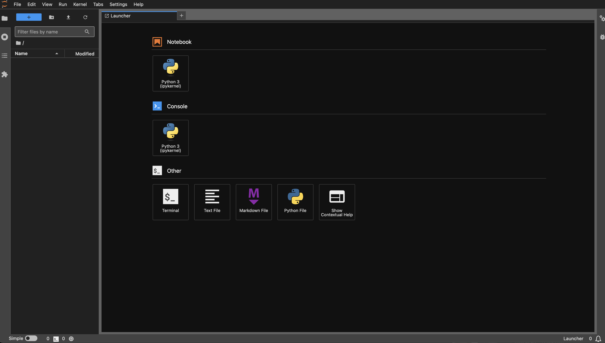
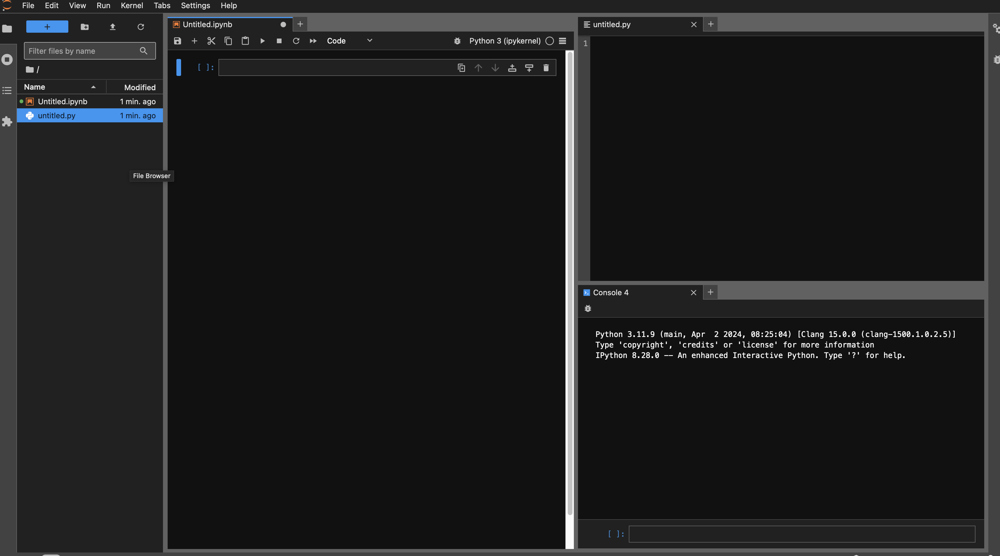

# JupyterLab

Up to now, your workflow relied on the Spyder IDE, in which you executed Python code interactively within the console (effectively "IPython"), or non-interactively via Python scripts. 

As an alternative, we will cover the basics of using the JupyterLab interface, highlighting the common use-cases for it, and also how it differs from the Spyder IDE.

JupyterLab can be started via the main menu of the Anaconda Navigator:
<div>

</div>

which will automatically open up a webpage in your local web browser, at usually the following URL: `http://localhost:8888/lab/tree`. 

### The Basics

#### Main menu (launcher screen)
<div>
    
</div>

Besides the File Browser on the left, you will be presented with a number of different components that you may start up:
1. Notebook
2. Console 
3. Terminal
4. Text File
5. Markdown File
6. Python File
7. Show Contextual Help

#### Key reasons for using JupyterLab over Spyder
- Notebooks offer data scientists arguably a more convenient and interactive way of working on their datasets within not just the Python framework, but also R and others.
  
- Custom (split) views

  <div>
    
</div>

- Developing markdown content
  
- Multiple independent kernels, each with own Console Editors/Output Views

- Built-in rendering for e.g. CSV, image and even PDF files.

- And more...!


#### Notebooks

Let's continue getting comfortable with the most common component -- Notebooks. Using a familiar package, let's explore some data available on the web:

```
import pandas as pd

wiki_url = 'https://en.wikipedia.org/wiki/List_of_potentially_habitable_exoplanets'
df = pd.read_html(wiki_url, match="Object")[0]
print(df)
```

The above should produce the following output:
```
	Object	Star	Star type	Mass (M⊕)	Radius (R⊕)	Density (g/cm3)	Flux (F⊕)	Teq (K)	Period (days)	Distance (ly)	Refs/Notes
0	Earth (reported for reference)	Sun	G2V	1.00	1.00	5.514	1.00	255	365.25	0	Only planet known to support life.
1	Venus (reported for reference)	Sun	G2V	0.815	0.9499	5.243	1.911	244.261	224.7	4.2×10^-6	[5]
2	Gliese 12 b	Gliese 12	M4V	0.88+0.39 −0.26	1.03±0.11	4.44	1.6±0.2	315	12.76144±0.00006	40	[6]
3	Gliese 163 c	Gliese 163	M3V	≥6.80	—	—	1.25	277	25.6	49	[1]
4	Gliese 180 c	Gliese 180	M2V	≥6.40	—	—	0.78	239	24.3	39	Not confirmed[1][7]
...	...	...	...	...	...	...	...	...	...	...	...
62	TRAPPIST-1e	TRAPPIST-1	M8V	0.69	0.92	5.65	0.65	230	6.1	41	Confirmed to be rocky[49][50]
63	TRAPPIST-1f	TRAPPIST-1	M8V	1.04	1.04	3.3 ± 0.9	0.37	200	9.2	41	Confirmed to be rocky[49][50]
64	TRAPPIST-1g	TRAPPIST-1	M8V	1.32	1.13	4.186	0.25	182	12.4	41	Confirmed to be rocky[49][50]
65	Wolf 1069 b	Wolf 1069	M5V	≥1.26	~1.08	—	0.65	250	15.6	31.2	[51]
66	Wolf 1061c	Wolf 1061	M3V	≥3.41	~1.60	—	1.30	271	17.9	13.8	[1]
```

Let's say we made some edits to our Pandas DataFrame, and would like to export this to a csv file:
```
df.to_csv('exoplanets.csv', index = True)
```

We can also easily open the saved csv file within JupyterLab, which will provide a very nice formatted view of the contents.
